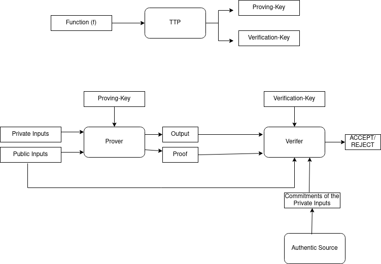

# Privacy-Preserving-ORB-Matching-system

## 📁 Project Structure

```

Privacy-Preserving-ORB-Matching-system/
├── Circom_Circuits/              
│   ├── ORB_Matcher.circom      # The main Circom Circuit implementing ORB Matching
│   └── ORB_Utils.circom        # The Circuit implementing utility templates required by 'ORB_Matcher.circom'
├── Images/              
│   ├── Item1
│   │   └── image1.jpg, image2.jpg, image3.jpg
│   │              # Test images for item1
│   └── Item2
│       └── image1.jpg, image2.jpg, image3.jpg
│                  # Test images for item2
├── Python_Progs/              
│   ├── featureExtracter.py   # extracts ORB descriptors from image and saves into a '.pkl' file.
│   │                            Uses OpenCV (cv2) library.
│   ├── standardMatcher.py    # performs ORB matching using "cv2.BFMatcher"
│   │                            and applying Lowe's ratio test  
│   ├── ORB_Matcher.py        # performs exactly the same task as "standardMatcher.py" however
│   │                           without using python standard libraries. Implements hamming_distance
│   │                           function, KNN matching logic, Lowe's ratio test from the scratch.
│   └── circomPreprocessor.py # Takes feature files in '.pkl' formats, converts them as binary
│                               2-D matrices in JSON format required for the Circom program. 
├── MerkelRootCal/    
│   └── calMerkleRoot.js  # Calculates MerkleRoots of the two feature matrices generated by
│                            "circomPreprocessor.py". For each feature matrix, it generates
│                             two roots - left (taking leftmost 128 bits of each feature vector)
│                             and right (with the rest)
├── tmp/              # Contains the feature files (.pkl) generated by "featureExtracter.py"
├── ORB_Circom.sh             # takes two image files, extracts their features using "featureExtracter.py",
│                               generates "CircomInput.JSON" from the extracted feature files, Calculates
│                               and attaches MerkleRoots using "calMerkleRoot.js" and finally runs the
│                               "ORB_Matcher.circom" Circom Code on "circomInputWithHash.json" to calculate matches
├── ORB_Python.sh             # takes two image files, extracts their features using the "featureExtracter.py"
│                               program and then runs the "ORB_Matcher.py" Python Code on the two extracted
│                               feature files to calculate matches
├── TestScript.sh             # executes the "ORB_Matcher.py" Python Code for every pair of iamges from
│                                1) same Item and 2) from different items.  
└── params.dat             # Contains all the configuration parameters from whcih "standardMatcher.py",
                             "ORB_Matcher.py" and "circomPreprocessor.py" reads the values and configures
                             the python and circom matcher codes with exactly the same configurations.

```

## ⚙️ Prerequisite:-

- UNIX OS (Ubuntu)
- NodeJS (Version 16.x or higher) [Click here](https://nodejs.org/en)
- SNARKJS (`npm install -g snarkjs`)
- Circom [Click here](https://docs.circom.io/getting-started/installation/)
- Circomlib [Click here](https://github.com/iden3/circomlib.git)
- Python3
- A theoretical background on KNN algoithm (using hamming distance), ORB matching using Lowe's ratio test

### 🧠 Brief Background of ZKP System:-

[🔝 Back to Top](#)

- A zero-knowledge proof system (ZKP) involves three types of entities, viz., **prover**, **verifier** and a **trusted third party** (TTP)
- A ZKP also involves a **Computation** which is some arbitrary function / algorithm ($f$)
- The inputs to the function $f$ are of two types, viz., **public inputs** and **private inputs**
- The public inputs are shared by the prover with the verifier, while the private inputs are kept secret only to the prover
- The public inputs must include some **commitments** (usually hash) of the private inputs used in the computation
- The verifier receives the commitments of the private inputs through some authentic / trusted channel
- The TTP generates a key-pair corresponding to the computation functions $f$
- The key-pair consists of a **proving-key** - which is used by the prover, and a **verification-key** - used by the verifier
- The prover generates the output of the computation ($f$) along with a proof $$\pi$$
- The output along with the proof  $$\pi$$ is sent to the verifier
- The **soundness** property of the ZKP system ensures that the verification will be successful only when the computation has been done correctly using the given public inputs
- The **zero-knowledge** property of the ZKP system ensures that no information can be retrieved regarding the private inputs used in the computation from either the public inputs or the proof $$\pi$$.
- The ZKP concept is elaborated by the following figure:-

  <p align="center">
    
  </p>


  
### 🛠️ Role of Circom and SNARKJS Tools in Implementing a ZKP System:-

[🔝 Back to Top](#)

- Circom provides an way to define an arbitrary computation ($f$) in a high-level programming language (circom language)
- In addition to defining the logic of the computation algorithm , we can define which inputs will be public and which will be private using this language's constructs
- Circom compiler generates an R1CS file which is a Matrix representation of the defined computation algorithm ($f$)
- The R1CS file is given as the input to the SNARKJS tool-chain
- The SNARKJS tool is used in three phases, viz., **Setup Phase**, **Proof Generation Phase** and the **Verification Phase**
  - The Setup Phase takes the R1CS file and generates a Prover-Key, Verification-Key pair corresponding to it
  - The Proof Generation Phase is further executed in two steps, viz., **Witness Generation Phase** and **Final Proof Generation Phase**
    - The **Witness Generation Phase** takes the R1CS file and the inputs to the computation (both public and private inputs) and produces an Extended Witness Vector
      - The Inputs to this phase are supplied in a JSON file
      - The Extended Witness Vector contains all the given input values, the generated output values along with the results of all intermediate calculations
    - The **Final Proof Generation Phase** takes the generated Witness file and the prover-key and generates two files - Public.JSON and Proof.JSON
      - The Public.JSON contains all the public inputs along with the outputs of the computation
      - The Proof.JOSN contains the cryptographic proof of correctness of the computation
  - The **Verification Phase** takes Public.JSON, Proof.JSON and the Verification-Key to verify. It results in ACCEPTANCE if everything is OK,REJECT otherwise
- SNARKJS tool currently supports three cryptographic protocols for the generation of the proof, viz., Groth16, Plonk and Fflonk protocol

### 💡 Our Proposed Idea:-

[🔝 Back to Top](#)

The main objective of this project was to write circom circuits to perform ORB matching in a privacy-preserving manner. However, the circuits cannot work directly on the original images, rather we use python codes for feature extractions and convering it into JSON format required by circom. Moreover, the circuits also verifies the correctness of the image-descriptors fade to it by verifying their Merkle-root hashes. The circuit also calculates some output scores as a result of the matching operation. The details of our ZKP system are as follows:-

- **Private Inputs**: The actual extracted image features
- **Commitments to Private Inputs**: Merkle-Root Hashes of the extracted image features
- **Public Inputs** (other than the Commitments to Private Inputs): The ORB matching configuration parameters such as Lowe's Ratio, max_matches, dist_weight, match_cnt_threshold (see inside the "params.dat" file for detailed descriptions on these parameters)
- **What the Computation Function genertates as output?**
  - A boolean value to indicate whether the given image features matches with the given Merkle-Root Hashes 
  - No. of Good Matches
  - AvgMinDist for Good Matches
  - Normalized Avg Distance
  - Normalized Match Count
  - Final Match Score
  - Final Result: the two images match or not
    
- **Who is the Prover?**: Any entity / organization having a temper-proof h/w device which can extract ORB descriptors from an image and also can generate digital signature on the Merkle-Root Hash of the extracted descriptors.
- **Who is the Verifier?**: Any entity / organization who wants to remotely verify that an  image scanned by a trusted temper-proof device is not the image of a specific object in a privacy-preserving way. Note that in this verification process, the verifies learns nothing about the scanned image.
- **Who is the TTP?**: Any globally trusted third party or, blockchain. Note that the private inputs are not disclosed to the TTP. It only generates the proving-key and verificationkey from a specific computation function $f$.
  
- **How does the Verifier (end-user) gets the commitments to private inputs (Merkle-Root Hashes of the Extracted Features of the two Images)?**
  - One image with which the verifier wants to compare is held by the verifier itself.
  - The Merkle-Root hash of the extracted features of the other image (scanned by the remote temper-proof device) is digitally signed by the device
  - The prover sends the above Merkle-Root hash along with the digital signature to the verifier
  - The verifier can get the authentic public-key of the temper-proof device from it's manufacturer's website
  - The verifier verifies the digital signature using the public key of the temper-proof device
    


### 🧪  What we have Implemented in this Prototype Version?

[🔝 Back to Top](#)


In order to test the correctness of our implemented circom circuits we have also written python codes for performing ORB matching. We have written two different versions of python codes for this purpose, viz., one using standard CV2 libraray and the other from the scratch. The purpose of writing the python codes from the scratch was to mimic the algorithm into a circom circuit. Here is a summary of our contributions:-

- We have written Python programs:-
  - a python program to extract ORB descriptors from an image
  - a python program to perform ORB matching bewteen two feature files (.pkl files) corresponding to two images, using standard CV2 libraray of python
  - a python program which can achieve excatly the same task as stated above; however, without using CV2 libraray. All the functions were written from the scratch. Additionally this program also calculates some output scores as the result of the matching operation.
  - a python program to generate input file (in JSON format) from the extracted ORB descriptors of images, required by the circom program
- We have written JavaScript program:-
  - to calculate the Merkle-Root hashes of the extracted ORB descriptors
- We have written the circom circuits to perform ORB matching bewteen two feature files and generate output scores as the result of the matching operation. The circom implementataion can achieve exactly the same objective as the Python ORB matcher. However, the circom codes can do it in a privacy-preserving manner as the actual ORB descriptors of images are taken as private-inputs. The circuit also verifies whether the private-inputs used in the computataion matches their Markle-Root hashes or not.
  
- Digital Signature generation and verification is not part of this project - whcih can be achieved using any standard crypto. library or tool


## 🚀 How to Use/Test this Repository:-

We take a two-fold strategy for testing the correctness of our implementations. First, we verify that the python ORB matcher version written from the scratch without any libraray function gives exactly the same output as the python version using standard libraray function for same input images. Next, we verify that the circom ORB matcher also gives exactly the same output as the python ORB matcher version written from the scratch. To do this follow the steps described below:-

### Step1: Verify the Python ORB_Matcher:-

#### Grant Exeuton Priviledge to the bash scripts:-

```
chmod +x ORB_Python.sh
chmod +x TestScript.sh
chmod +x ORB_Circom.sh
```

#### Eextract feature files from any two image files using the "featureExtracter.py" program. 
```
python3 ./Python_Progs/featureExtracter.py -i ./Images/Item1/image1.jpg -o ./tmp/Features1.pkl -n 100
python3 ./Python_Progs/featureExtracter.py -i ./Images/Item1/image2.jpg -o ./tmp/Features2.pkl -n 100
```
First argument is input filename, second argument is output filename and the third argument is no. of features to be extracted.

#### Run the ORB_Matcher Python Code on the two extracted feature files:-
```
python3 ./Python_Progs/ORB_Matcher.py ./tmp/Features1.pkl ./tmp/Features2.pkl 100 100
```
#### Cross-check the correctness of "ORB_Matcher.py":- 

Cross-check the correctness of "ORB_Matcher.py" using the "standardMatcher.py" by matching the output of the two programs on the same feature files:

```
python3 ./Python_Progs/standardMatcher.py -pkl1 ./tmp/Features1.pkl -pkl2 ./tmp/Features2.pkl
```

#### Run the following script to execute "ORB_Matcher" Python Code on any two images of your choice:- 

The following script takes two image files, extracts their features using the "featureExtracter.py" program and then runs the "ORB_Matcher" Python Code on the two extracted feature files to calculate matches.

```
./ORB_Python.sh 100 ./Images/Item1/image1.jpg ./Images/Item1/image2.jpg
```
#### Run the following script to Test the Accuracy of Our "ORB_Matcher" Python Code on the Given Test Images:-

The following script executes the "ORB_Matcher" Python Code for every pair of iamges from 1) same Item and 2) from different items.  The script internally calls the "ORB_Python.sh" script in iteraton. Before running the following script, set the debug flag to zero in "ORB_Python.sh" (for ease of visualiztion only).

```
./TestScript.sh
```

==========================================================================================================
### Step2: Verify the Python ORB_Matcher:-

#### Eextract feature files from any two image files of your choice using the "featureExtracter.py" program.
```
python3 ./Python_Progs/featureExtracter.py -i ./Images/Item1/image1.jpg -o ./tmp/Features1.pkl -n 100
python3 ./Python_Progs/featureExtracter.py -i ./Images/Item1/image2.jpg -o ./tmp/Features2.pkl -n 100
```
#### Run "circomPreprocessor.py" to generate "CircomInput.JSON" from the extracted feature files. 
```
python3 ./Python_Progs/circomPreprocessor.py ./tmp/Features1.pkl ./tmp/Features2.pkl 100 100
```
#### cd inside the "Circom_Circuits" dir and Compile the main Circom_Circuit using the following command:-
```
circom ORB_Matcher.circom --r1cs --wasm --sym -l /home/smaity/
```
#### Attach Merkle Roots:-

Go back to project root-dir and  run the folloiwng.

```
node ./MerkelRootCal/calMerkleRoot.js 
```
#### To generate Witness run the following command:-
```
node ./Circom_Circuits/ORB_Matcher_js/generate_witness.js ./Circom_Circuits/ORB_Matcher_js/ORB_Matcher.wasm circomInputWithHash.json witness.wtns
```
This will show the output generated by the circom circuit on the terminal.

#### Run the following script to execute "ORB_Matcher" Circom Code on any two images of your choice:- 

The following script takes two image files, extracts their features using the "featureExtracter.py" program, generates "CircomInput.JSON" from the extracted feature files, attaches Merkle-roots and finally runs the "ORB_Matcher" Circom Code on the two extracted feature files to calculate matches:-

```
./ORB_Circom.sh 100 ./Images/Item1/image1.jpg ./Images/Item1/image2.jpg
```

==========================================================================================================

### Step2: Compare the Circom ORB_Matcher with the Python ORB_Matcher:-

Now you can compare the result produced by the Python program and the result produced by the Circom program on any two images of your choice by just comparing the outcome of folloiwng two scripts:-
```
./ORB_Python.sh 100 ./Images/Item1/image1.jpg ./Images/Item1/image2.jpg
```

VS.
```
./ORB_Circom.sh 100 ./Images/Item1/image1.jpg ./Images/Item1/image2.jpg
```

## 🙌 Credits:-

[🔝 Back to Top](#)

- MANASA PJ (Developper)
- SHALINI TS (Developper)
- DR. SOUMYADEV MAITY (Mentor)
